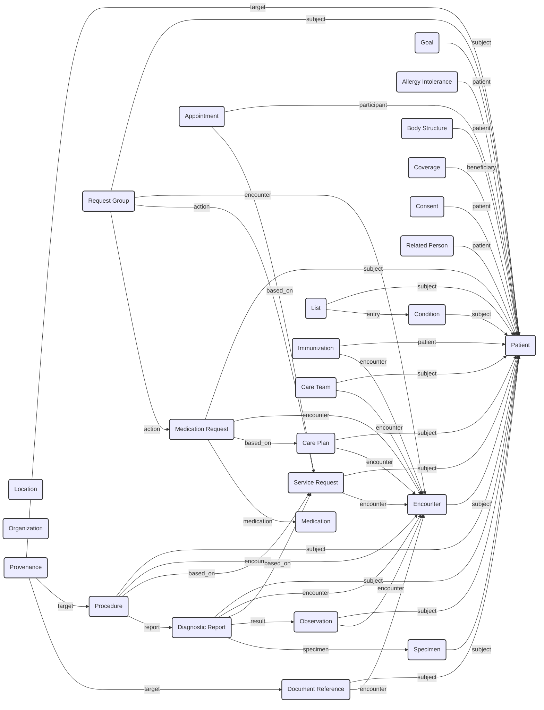

# FHIR Resource ID Crosswalk and Mapping

**Version**: 2.1 (Final, Corrected)
**Date**: 2025-11-01

## 1. Visual Linkage Framework (Mermaid)

This diagram provides a comprehensive visual overview of the relationships between all primary FHIR resources.



## 2. Introduction

This document provides a comprehensive crosswalk for the flattened FHIR resources in the Athena database. It outlines the primary keys, links to patients, and cross-resource references for each major table.

The visual linkage framework and detailed mappings in this document serve as a single source of truth for understanding the complex relationships within the FHIR data. This clarity is invaluable for a wide range of operational and analytical activities.

### Value and Operational Utility

The primary value of this framework is in providing a clear, unambiguous, and easily digestible map of the data landscape. This has several key benefits:

*   **Accelerated Development and Analysis**: By removing ambiguity, developers and data scientists can build queries and applications more quickly and with greater confidence. The visual diagram and explicit join principles significantly reduce the time required to understand and work with the data.
*   **Faster Onboarding**: New team members can rapidly familiarize themselves with the data model, enabling them to become productive in a fraction of the time it would take without such a guide.
*   **Improved Data Governance and Quality**: The framework establishes clear rules for data relationships. This allows for the creation of automated data quality checks to identify and remediate orphaned or incorrectly linked records, thereby improving the overall integrity of the database.
*   **Simplified and Standardized Querying**: The "Key Principles" section provides a clear and standardized approach to querying the data. This consistency makes queries easier to write, read, and maintain across different teams and projects.
*   **Foundation for Advanced Applications**: A robust and well-understood data linkage framework is the essential foundation for building sophisticated applications, including:
    *   **Longitudinal Patient Views**: Constructing a complete, timeline-based view of a patient's journey.
    *   **Cohort Discovery**: Identifying patient populations with specific combinations of clinical characteristics.
    *   **Predictive Modeling**: Building and validating models that rely on features from multiple, interconnected data sources.

In essence, this framework transforms a complex web of data into a navigable and actionable resource, unlocking the full potential of the underlying FHIR data for both clinical and research purposes.

**Key Principles**:
- **ID Formatting**: All `id` and `*_reference` columns in this database store **raw IDs** (e.g., `eXA.rXjj4424vjOfgpbR13A3`). They do **not** include the resource type prefix (e.g., `Patient/`). Joins between tables should be performed on these raw IDs.
- **Patient Connection**: Every clinical resource must link back to a patient. This is almost always done via a column named `subject_reference` or `patient_reference` which contains the raw patient ID.
- **Parent-Child Hierarchy**: The schema is flattened. Nested FHIR elements are in separate tables. The link is maintained by a column `{parent_table_name}_id` in the child table, which is a foreign key to the parent table's `id` column.
- **Cross-Resource References**: Connections between different resources are handled by `*_reference` columns, which contain the raw ID of the target resource.

## 3. Core Resource Mappings

### 3.1. `patient`

The central resource. All other clinical data links back to this table.

| Column | Description | Target Table | Target Column | Example Value |
| :--- | :--- | :--- | :--- | :--- |
| **`id`** | **Primary Key** | `patient` | `id` | `eXA.rXjj4424vjOfgpbR13A3` |
| `identifier_mrn` | Patient's Medical Record Number | - | - | `1234567` |

### 3.2. `encounter`

Represents a patient visit or interaction.

| Column | Description | Target Table | Target Column | Example Value |
| :--- | :--- | :--- | :--- | :--- |
| **`id`** | **Primary Key** | `encounter` | `id` | `eApqkdnAP-xI5mmLK.9GKMA3` |
| `subject_reference` | Link to the patient | `patient` | `id` | `eXA.rXjj4424vjOfgpbR13A3` |
| `part_of_reference` | Link to a parent encounter | `encounter` | `id` | `e544PofJ6vh2iIS0Q4EkBwA3` |
| `service_provider_reference`| Link to the performing organization | `organization` | `id` | `org123`|

**Child Tables**:
- `encounter_diagnosis`: Links to `condition` via `diagnosis_condition_reference`.
- `encounter_location`: Links to `location` via `location_location_reference`.
- `encounter_appointment`: Links to `appointment` via `appointment_reference`.

### 3.3. `observation`

Represents measurements, labs, and simple observations.

| Column | Description | Target Table | Target Column | Example Value |
| :--- | :--- | :--- | :--- | :--- |
| **`id`** | **Primary Key** | `observation` | `id` | `obs123` |
| `subject_reference` | Link to the patient | `patient` | `id` | `eXA.rXjj4424vjOfgpbR13A3` |
| `encounter_reference` | Link to the visit | `encounter` | `id` | `eApqkdnAP-xI5mmLK.9GKMA3` |
| `specimen_reference` | Link to the collected specimen | `specimen` | `id` | `spec123` |
| `device_reference` | Link to the device used | `device` | `id` | `dev123` |
| `performer_reference` | Link to the practitioner/org | `practitioner` or `organization` | `id` | `pract123`|

**Child Tables**:
- `observation_component`: Contains components of a panel observation. Links via `observation_id`.
- `observation_based_on`: Links to a `servicerequest` via `based_on_reference`.
- `observation_derived_from`: Links to `documentreference`, `imagingstudy`, etc. via `derived_from_reference`.

### 3.4. `procedure`

Represents surgical procedures and other interventions.

| Column | Description | Target Table | Target Column | Example Value |
| :--- | :--- | :--- | :--- | :--- |
| **`id`** | **Primary Key** | `procedure` | `id` | `fLDdtmkMfv0wRvbxNmPWtBl96...` |
| `subject_reference` | Link to the patient | `patient` | `id` | `eXA.rXjj4424vjOfgpbR13A3` |
| `encounter_reference` | Link to the visit | `encounter` | `id` | `eApqkdnAP-xI5mmLK.9GKMA3` |
| `location_reference` | Link to the location | `location` | `id` | `loc123` |
| `recorder_reference` | Link to the recording practitioner | `practitioner` | `id` | `pract123` |
| `asserter_reference` | Link to the asserting practitioner | `practitioner` | `id` | `pract456` |

**Child Tables**:
- `procedure_reason_reference`: Links to `condition` or `observation` explaining why procedure was done.
- `procedure_report`: Links to `diagnosticreport` via `report_reference`.
- `procedure_complication_detail`: Links to `condition` representing a complication.

### 3.5. `document_reference`

Represents clinical notes and other documents.

| Column | Description | Target Table | Target Column | Example Value |
| :--- | :--- | :--- | :--- | :--- |
| **`id`** | **Primary Key** | `document_reference` | `id` | `doc123`|
| `subject_reference` | Link to the patient | `patient` | `id` | `eXA.rXjj4424vjOfgpbR13A3` |
| `authenticator_reference`| Link to the authenticating user/org | `practitioner` or `organization` | `id` | `pract123` |
| `custodian_reference` | Link to the custodian organization | `organization` | `id` | `org123` |

**Child Tables**:
- `document_reference_context_encounter`: Links to `encounter` via `context_encounter_reference`.
- `document_reference_content`: Contains the actual document content/link, links via `document_reference_id`.
- `document_reference_relates_to`: Can link to other `document_reference` records.

---

## 4. Comprehensive Resource Mappings

This section contains a detailed breakdown of all resources and their connections as inferred from the schema.

---

### 4.1. `allergy_intolerance`

**Description**: Records a clinical assessment of an allergy or intolerance.

| Column | Description | Target Table(s) | Target Column | Example Value |
| :--- | :--- | :--- | :--- | :--- |
| **`id`** | **Primary Key** | `allergy_intolerance` | `id` | `allergy123` |
| `patient_reference` | Link to the patient | `patient` | `id` | `eXA.rXjj4424vjOfgpbR13A3` |
| `encounter_reference` | Link to the visit when recorded | `encounter` | `id` | `eApqkdnAP-xI5mmLK.9GKMA3` |
| `recorder_reference` | Who recorded the allergy | `practitioner`, `patient` | `id` | `pract123` |
| `asserter_reference` | Who asserted the allergy | `practitioner`, `patient`, `relatedperson` | `id` | `pract456` |

**Child Tables**:
- `allergy_intolerance_category`: Links via `allergy_intolerance_id`.
- `allergy_intolerance_reaction`: Links via `allergy_intolerance_id`.

---

### 4.2. `appointment`

**Description**: A scheduled appointment for a patient.

| Column | Description | Target Table(s) | Target Column | Example Value |
| :--- | :--- | :--- | :--- | :--- |
| **`id`** | **Primary Key** | `appointment` | `id` | `appt123` |

**Child Tables & Key References**:
- `appointment_participant`: Links via `appointment_id`.
  - `participant_actor_reference`: **Crucial link to who is in the appointment**. Can be `patient`, `practitioner`, `location`, `relatedperson`.
- `appointment_reason_reference`: Links via `appointment_id`.
  - `reason_reference_reference`: Links to `condition` or `observation` that is the reason for the appointment.
- `appointment_based_on`: Links via `appointment_id`.
  - `based_on_reference`: Links to the `servicerequest` that this appointment fulfills.
- `appointment_slot`: Links via `appointment_id`.
  - `slot_reference`: Links to a `slot` in a schedule.

---

### 4.3. `care_plan`

**Description**: A plan of care for a patient.

| Column | Description | Target Table(s) | Target Column | Example Value |
| :--- | :--- | :--- | :--- | :--- |
| **`id`** | **Primary Key** | `care_plan` | `id` | `cp123` |
| `subject_reference` | Link to the patient | `patient` | `id` | `eXA.rXjj4424vjOfgpbR13A3` |
| `encounter_reference` | Link to the encounter creating the plan | `encounter` | `id` | `eApqkdnAP-xI5mmLK.9GKMA3` |
| `author_reference` | Who created the plan | `practitioner`, `organization`, `patient` | `id` | `pract123` |
| `replaces_reference` | A plan this one replaces | `care_plan` | `id` | `cp122` |
| `part_of_reference` | A larger plan this is part of | `care_plan` | `id` | `cp100` |

**Child Tables & Key References**:
- `care_plan_activity`: Links via `care_plan_id`.
  - `activity_reference_reference`: **Crucial link to the actual order**. Can be `medication_request`, `service_request`, `devicerequest`, etc.
- `care_plan_addresses`: Links via `care_plan_id`.
  - `addresses_reference`: Links to the `condition` being addressed.
- `care_plan_goal`: Links via `care_plan_id`.
  - `goal_reference`: Links to a `goal` resource.

---

### 4.4. `condition`

**Description**: A clinical condition, problem, diagnosis, or other event.

| Column | Description | Target Table(s) | Target Column | Example Value |
| :--- | :--- | :--- | :--- | :--- |
| **`id`** | **Primary Key** | `condition` | `id` | `cond123` |
| `subject_reference` | Link to the patient | `patient` | `id` | `eXA.rXjj4424vjOfgpbR13A3` |
| `encounter_reference` | Link to the visit when diagnosed | `encounter` | `id` | `eApqkdnAP-xI5mmLK.9GKMA3` |
| `recorder_reference` | Who recorded the condition | `practitioner`, `patient` | `id` | `pract123` |
| `asserter_reference` | Who asserted the condition | `practitioner`, `patient` | `id` | `pract456` |

**Child Tables**:
- `condition_stage`: Links via `condition_id`.
  - `stage_assessment`: Can link to `diagnosticreport` or `observation`.
- `condition_evidence`: Links via `condition_id`.
  - `evidence_detail`: Can link to any other resource as evidence.

---

### 4.5. `diagnostic_report`

**Description**: The findings and interpretation of diagnostic tests.

| Column | Description | Target Table(s) | Target Column | Example Value |
| :--- | :--- | :--- | :--- | :--- |
| **`id`** | **Primary Key** | `diagnostic_report` | `id` | `dr123` |
| `subject_reference` | Link to the patient | `patient` | `id` | `eXA.rXjj4424vjOfgpbR13A3` |
| `encounter_reference` | Link to the visit | `encounter` | `id` | `eApqkdnAP-xI5mmLK.9GKMA3` |
| `performer_reference` | Who performed the test | `practitioner`, `organization` | `id` | `org123` |
| `results_interpreter_reference` | Who interpreted the results | `practitioner`, `organization` | `id` | `pract123` |

**Child Tables & Key References**:
- `diagnostic_report_result`: Links via `diagnostic_report_id`.
  - `result_reference`: **Crucial link to the individual results**. Links to `observation` resources.
- `diagnostic_report_specimen`: Links via `diagnostic_report_id`.
  - `specimen_reference`: Links to the `specimen` that was tested.
- `diagnostic_report_imaging_study`: Links via `diagnostic_report_id`.
  - `imaging_study_reference`: Links to an `imagingstudy` resource.
- `diagnostic_report_based_on`: Links via `diagnostic_report_id`.
  - `based_on_reference`: Links to the `servicerequest` that ordered this report.

---

### 4.6. `medication_request`

**Description**: An order or request for medication.

| Column | Description | Target Table(s) | Target Column | Example Value |
| :--- | :--- | :--- | :--- | :--- |
| **`id`** | **Primary Key** | `medication_request` | `id` | `mr123` |
| `subject_reference` | Link to the patient | `patient` | `id` | `eXA.rXjj4424vjOfgpbR13A3` |
| `encounter_reference` | Link to the visit | `encounter` | `id` | `eApqkdnAP-xI5mmLK.9GKMA3` |
| `requester_reference` | Who ordered the medication | `practitioner`, `organization`, `patient` | `id` | `pract123` |
| `medication_reference_reference` | The medication being ordered | `medication` | `id` | `med123` |
| `prior_prescription_reference` | Link to a previous request | `medication_request` | `id` | `mr122` |

**Child Tables & Key References**:
- `medication_request_reason_reference`: Links via `medication_request_id`.
  - `reason_reference_reference`: Links to a `condition` or `observation` that is the reason for the medication.
- `medication_request_based_on`: Links via `medication_request_id`.
  - `based_on_reference`: Links to a `care_plan` this request is part of.

---

### 4.7. `service_request`

**Description**: A request for a service to be performed.

| Column | Description | Target Table(s) | Target Column | Example Value |
| :--- | :--- | :--- | :--- | :--- |
| **`id`** | **Primary Key** | `service_request` | `id` | `sr123` |
| `subject_reference` | Link to the patient | `patient` | `id` | `eXA.rXjj4424vjOfgpbR13A3` |
| `encounter_reference` | Link to the visit | `encounter` | `id` | `eApqkdnAP-xI5mmLK.9GKMA3` |
| `requester_reference` | Who ordered the service | `practitioner`, `organization`, `patient` | `id` | `pract123` |
| `performer_reference` | Who should perform the service | `practitioner`, `organization`, etc. | `id` | `org123` |

**Child Tables & Key References**:
- `service_request_specimen`: Links via `service_request_id`.
  - `specimen_reference`: Links to a `specimen` to be collected or used.
- `service_request_based_on`: Links via `service_request_id`.
  - `based_on_reference`: Links to a `care_plan` this request is part of.
- `service_request_replaces`: Links via `service_request_id`.
  - `replaces_reference`: Links to a `service_request` this one replaces.

---

### 4.8. `specimen`

**Description**: A sample of tissue, blood, etc.

| Column | Description | Target Table(s) | Target Column | Example Value |
| :--- | :--- | :--- | :--- | :--- |
| **`id`** | **Primary Key** | `specimen` | `id` | `spec123` |
| `subject_reference` | Link to the patient | `patient` | `id` | `eXA.rXjj4424vjOfgpbR13A3` |
| `collection_collector_reference` | Who collected the specimen | `practitioner` | `id` | `pract123` |

**Child Tables & Key References**:
- `specimen_parent`: Links via `specimen_id`.
  - `parent_reference`: Links to a parent `specimen` from which this one was derived.
- `specimen_request`: Links via `specimen_id`.
  - `request_reference`: Links to the `servicerequest` that ordered this specimen.

---

### 4.9. `body_structure`

**Description**: A specific anatomical location on a patient.

| Column | Description | Target Table(s) | Target Column | Example Value |
| :--- | :--- | :--- | :--- | :--- |
| **`id`** | **Primary Key** | `body_structure` | `id` | `bs123` |
| `patient_reference` | Link to the patient | `patient` | `id` | `eXA.rXjj4424vjOfgpbR13A3` |

---

### 4.10. `care_team`

**Description**: A group of people providing care to a patient.

| Column | Description | Target Table(s) | Target Column | Example Value |
| :--- | :--- | :--- | :--- | :--- |
| **`id`** | **Primary Key** | `care_team` | `id` | `ct123` |
| `subject_reference` | Link to the patient | `patient` | `id` | `eXA.rXjj4424vjOfgpbR13A3` |
| `encounter_reference` | Link to the visit | `encounter` | `id` | `eApqkdnAP-xI5mmLK.9GKMA3` |

**Child Tables & Key References**:
- `care_team_participant`:
  - `participant_member_reference`: Links to `practitioner`, `organization`, etc.

---

### 4.11. `consent`

**Description**: A record of a patient's consent.

| Column | Description | Target Table(s) | Target Column | Example Value |
| :--- | :--- | :--- | :--- | :--- |
| **`id`** | **Primary Key** | `consent` | `id` | `consent123` |
| `patient_reference` | Link to the patient | `patient` | `id` | `eXA.rXjj4424vjOfgpbR13A3` |

---

### 4.12. `coverage`

**Description**: Insurance or payment coverage for a patient.

| Column | Description | Target Table(s) | Target Column | Example Value |
| :--- | :--- | :--- | :--- | :--- |
| **`id`** | **Primary Key** | `coverage` | `id` | `cov123` |
| `beneficiary_reference` | The patient covered | `patient` | `id` | `eXA.rXjj4424vjOfgpbR13A3` |
| `policy_holder_reference` | Who holds the policy | `patient`, `related_person`, `organization` | `id` | `eXA.rXjj4424vjOfgpbR13A3` |
| `subscriber_reference` | The subscriber | `patient`, `related_person` | `id` | `eXA.rXjj4424vjOfgpbR13A3` |

---

### 4.13. `goal`

**Description**: A care goal for a patient.

| Column | Description | Target Table(s) | Target Column | Example Value |
| :--- | :--- | :--- | :--- | :--- |
| **`id`** | **Primary Key** | `goal` | `id` | `goal123` |
| `subject_reference` | Link to the patient | `patient` | `id` | `eXA.rXjj4424vjOfgpbR13A3` |

---

### 4.14. `immunization`

**Description**: An immunization event.

| Column | Description | Target Table(s) | Target Column | Example Value |
| :--- | :--- | :--- | :--- | :--- |
| **`id`** | **Primary Key** | `immunization` | `id` | `imm123` |
| `patient_reference` | Link to the patient | `patient` | `id` | `eXA.rXjj4424vjOfgpbR13A3` |
| `encounter_reference` | Link to the visit | `encounter` | `id` | `eApqkdnAP-xI5mmLK.9GKMA3` |

---

### 4.15. `list`

**Description**: A list of items (e.g., a problem list).

| Column | Description | Target Table(s) | Target Column | Example Value |
| :--- | :--- | :--- | :--- | :--- |
| **`id`** | **Primary Key** | `list` | `id` | `list123` |
| `subject_reference` | Link to the patient | `patient` | `id` | `eXA.rXjj4424vjOfgpbR13A3` |
| `encounter_reference` | Link to the visit | `encounter` | `id` | `eApqkdnAP-xI5mmLK.9GKMA3` |

**Child Tables & Key References**:
- `list_entry`:
  - `entry_item_reference`: **Crucial link to the items in the list**. Can be any resource, commonly `condition`.

---

### 4.16. `location`

**Description**: A physical location.

| Column | Description | Target Table(s) | Target Column | Example Value |
| :--- | :--- | :--- | :--- | :--- |
| **`id`** | **Primary Key** | `location` | `id` | `loc123` |
| `part_of_reference` | Link to a parent location | `location` | `id` | `loc100` |
| `managing_organization_reference` | The managing organization | `organization` | `id` | `org123` |

---

### 4.17. `medication`

**Description**: A definitional resource for a medication.

| Column | Description | Target Table(s) | Target Column | Example Value |
| :--- | :--- | :--- | :--- | :--- |
| **`id`** | **Primary Key** | `medication` | `id` | `med123` |
| `manufacturer_reference` | The manufacturer | `organization` | `id` | `org123` |

---

### 4.18. `organization`

**Description**: A resource for an organization.

| Column | Description | Target Table(s) | Target Column | Example Value |
| :--- | :--- | :--- | :--- | :--- |
| **`id`** | **Primary Key** | `organization` | `id` | `org123` |
| `part_of_reference` | Link to a parent organization | `organization` | `id` | `org100` |

---

### 4.19. `provenance`

**Description**: Records the history of a resource.

| Column | Description | Target Table(s) | Target Column | Example Value |
| :--- | :--- | :--- | :--- | :--- |
| **`id`** | **Primary Key** | `provenance` | `id` | `prov123` |

**Child Tables & Key References**:
- `provenance_target`:
  - `target_reference`: **Crucial link to the resource being described**. Can be any resource.
- `provenance_agent`:
  - `agent_who_reference`: Who performed the action.

---

### 4.20. `related_person`

**Description**: A person related to the patient.

| Column | Description | Target Table(s) | Target Column | Example Value |
| :--- | :--- | :--- | :--- | :--- |
| **`id`** | **Primary Key** | `related_person` | `id` | `rp123` |
| `patient_reference` | Link to the patient | `patient` | `id` | `eXA.rXjj4424vjOfgpbR13A3` |

---

### 4.21. `request_group`

**Description**: A group of related requests.

| Column | Description | Target Table(s) | Target Column | Example Value |
| :--- | :--- | :--- | :--- | :--- |
| **`id`** | **Primary Key** | `request_group` | `id` | `rg123` |
| `subject_reference` | Link to the patient | `patient` | `id` | `eXA.rXjj4424vjOfgpbR13A3` |
| `encounter_reference` | Link to the visit | `encounter` | `id` | `eApqkdnAP-xI5mmLK.9GKMA3` |

**Child Tables & Key References**:
- `request_group_action`:
  - `action_resource_reference`: Links to the actual request (`servicerequest`, etc.).

---

## 5. Custom Tables and Views

This section analyzes the key custom tables and views (prefixed with `v_`) which demonstrate how the base FHIR resources are joined and utilized.

---

### 5.1. `surgical_procedures` (Table)

**Description**: A custom table that appears to hold a curated list of surgical procedures, likely as a supplement to the main `procedure` table.

| Column | Description | Target Table(s) | Target Column | Notes |
| :--- | :--- | :--- | :--- | :--- |
| `patient_id` | Link to the patient | `patient` | `id` | Raw Patient ID. |
| `procedure_id` | Link to the procedure | `procedure` | `id` | Raw Procedure ID. |
| `epic_case_orlog_id` | Epic-specific identifier | - | - | Useful for joining with other Epic data sources. |

---

### 5.2. `v_procedures_tumor` (View)

**Description**: A critical view that enriches tumor-related procedures with classification and annotation data.

**Inferred Joins**:
- `procedure` (base)
- `procedure_code_coding` (for CPT codes)
- `v_oid_reference` (for decoding coding systems)
- `procedure_reason_reference` (to find tumor-related reasons)

**Key ID Mappings**:

| Column | Description | Target Table(s) | Target Column |
| :--- | :--- | :--- | :--- |
| `patient_fhir_id` | Link to the patient | `patient` | `id` |
| `procedure_fhir_id` | The base procedure ID | `procedure` | `id` |
| `proc_encounter_reference` | Link to the visit | `encounter` | `id` |

---

### 5.3. `v_chemo_medications` (View)

**Description**: A comprehensive view that aggregates chemotherapy medication requests, linking them to care plans and classifying the drugs.

**Inferred Joins**:
- `medication_request` (base)
- `medication` (via `medication_reference_reference`)
- `care_plan` (via `care_plan_references`)
- `chemotherapy_drugs` (custom drug table)

**Key ID Mappings**:

| Column | Description | Target Table(s) | Target Column |
| :--- | :--- | :--- | :--- |
| `patient_fhir_id` | Link to the patient | `patient` | `id` |
| `encounter_fhir_id` | Link to the visit | `encounter` | `id` |
| `medication_request_fhir_id` | The base medication request ID | `medication_request` | `id` |
| `medication_fhir_id` | The medication definition | `medication` | `id` |
| `requester_fhir_id` | Who ordered the chemo | `practitioner` | `id` |
| `cp_id` | The associated care plan | `care_plan` | `id` |

---

### 5.4. `v_radiation_treatment_episodes` (View)

**Description**: A complex view that constructs radiation treatment episodes from multiple sources.

**Inferred Joins**:
- `observation` (for dose)
- `procedure` (for radiation procedures)
- `care_plan` (for treatment plans)
- `document_reference` (for treatment summaries)
- `appointment` (for treatment sessions)

**Key ID Mappings**:

| Column | Description | Target Table(s) | Target Column |
| :--- | :--- | :--- | :--- |
| `patient_fhir_id` | Link to the patient | `patient` | `id` |
| `episode_id` | A constructed unique ID for the episode | - | - |
| `constituent_document_ids` | An array of `document_reference` IDs | `document_reference` | `id` |

---

### 5.5. `v_unified_patient_timeline` (View)

**Description**: The main patient timeline view, aggregating events from many other views and tables.

**Key ID Mappings**:

| Column | Description | Target Table(s) | Target Column | Notes |
| :--- | :--- | :--- | :--- | :--- |
| `patient_fhir_id` | Link to the patient | `patient` | `id` | The central anchor of the timeline. |
| `event_id` | A constructed unique ID for the event | - | - | Unique within the timeline. |
| `source_id` | The FHIR ID of the source event | *Multiple* | `id` | Links back to the original resource (e.g., a `procedure.id` or `observation.id`). |
| `source_view` | The view the event came from | - | - | e.g., `v_procedures_tumor` |


## 6. Verification Queries

To verify these assumptions, we can run targeted queries.

### Example Query: Verify `document_reference` to `encounter` link

This query checks the values in `document_reference_context_encounter.context_encounter_reference` to confirm they are valid `Encounter` references.

```sql
SELECT 
    d.id as document_reference_id,
    d.subject_reference as patient_id,
    dce.context_encounter_reference as encounter_id
FROM 
    fhir_prd_db.document_reference d
JOIN 
    fhir_prd_db.document_reference_context_encounter dce ON d.id = dce.document_reference_id
WHERE 
    dce.context_encounter_reference IS NOT NULL
LIMIT 10;
```

This query pattern can be adapted to validate any of the relationships described in this document.